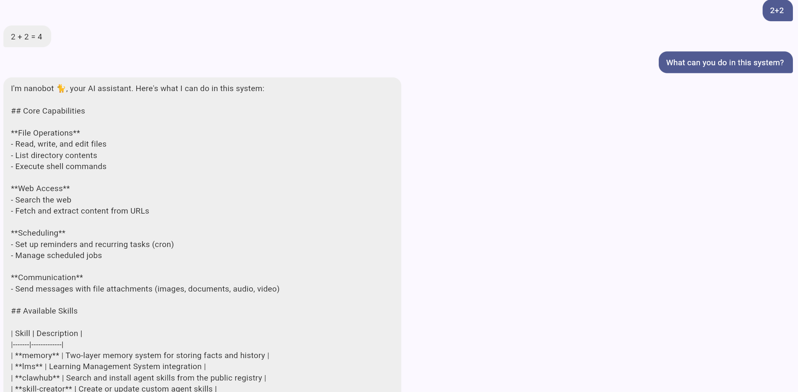
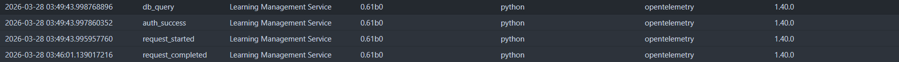
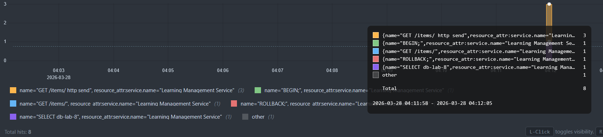
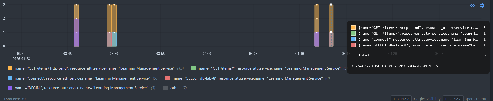

# Lab 8 — Report

Paste your checkpoint evidence below. Add screenshots as image files in the repo and reference them with ``.

## Task 1A — Bare agent

### Prompt
What is the agentic loop?

### Agent response
The agentic loop is the iterative reasoning and action cycle that AI agents follow to accomplish tasks. It typically consists of these core steps:

1. Perceive — Observe the current state of the environment or task context
2. Think/Reason — Analyze the situation, plan next steps, and decide what action to take
3. Act — Execute the chosen action (e.g., call a tool, write a file, send a message)
4. Observe Results — Receive feedback from the action's outcome
5. Repeat — Continue the loop until the goal is achieved

This loop enables agents to:
- Break complex tasks into smaller steps
- Adapt based on feedback and changing conditions
- Self-correct when errors occur
- Use tools and external resources effectively

In my case, each time I use a tool (like read_file, exec, or web_search), receive the result, and decide what to do next — that's one iteration of the agentic loop.

The quality of an agent depends on how well it reasons at each step and how effectively it uses the loop to make progress toward goals.

### Prompt
What labs are available in our LMS?

### Agent response
Based on the course materials, here are the 10 labs available in your LMS:

The course is structured around 10 labs, each 3 hours long. From the lab plan document, I can see details about:

Lab 8 (current): "The Agent is the Interface"

- Topic: AI agents as a new type of client interface for existing services
- Students set up nanobot agent from scratch, connect it to the LMS via MCP tools, add observability capabilities, and diagnose failures

Previous labs referenced:
- Lab 6: Earlier LMS setup (mentioned in setup instructions)
- Lab 7: Students built a Telegram bot with hardcoded slash commands and custom LLM tool-calling loop

Lab structure pattern: Each lab builds on previous work, progressively adding:
- Backend services
- Database (PostgreSQL)
- Frontend (React, Flutter)
- Chat clients (Telegram bot, web client)
- AI agent integration (nanobot)
- Observability (VictoriaLogs, VictoriaTraces)
- MCP tools and skills

The full list of all 10 lab topics isn't explicitly enumerated in the documents I found, but the course follows a progression from basic setup → full-stack development → AI agent integration → observability and proactive monitoring.

Would you like me to search for more specific information about other lab topics?

## Task 1B — Agent with LMS tools

### Prompt
What labs are available?

### Agent response
Based on the course materials, the SET (Software Engineering Toolkit) course consists of 10 labs, each 3 hours long.                                                                     

From the documents I found, here's what I can confirm:                                                                                                                                   

Lab Structure:                                                                                                                                                                           

 • The course has 10 labs total                                                                                                                                                          
 • Each lab is 3 hours long                                                                                                                                                              
 • Labs build progressively on a Learning Management Service (LMS) project                                                                                                               

Specific Labs Mentioned:                                                                                                                                                                 

 • Lab 6: Basic LMS setup                                                                                                                                                                
 • Lab 7: Building a Telegram bot with custom LLM tool-calling                                                                                                                           
 • Lab 8 (current): "The Agent is the Interface" - setting up nanobot AI agent with MCP tools                                                                                            

Lab Progression Topics:                                                                                                                                                                  

  1 Backend API setup (FastAPI + PostgreSQL)                                                                                                                                             
  2 Database design and seeding                                                                                                                                                          
  3 Frontend development (React)                                                                                                                                                         
  4 Reverse proxy (Caddy)                                                                                                                                                                
  5 Testing (unit + E2E)                                                                                                                                                                 
  6 Chat bot integration (Telegram)                                                                                                                                                      
  7 AI agent integration (nanobot + MCP)                                                                                                                                                 
  8 Observability (VictoriaLogs, VictoriaTraces)                                                                                                                                         
  9 Proactive monitoring (scheduled health checks)                                                                                                                                       
 10 (Final lab - not explicitly detailed)                                                                                                                                                

The LMS backend isn't currently running in your environment, so I can't query it directly for the complete lab list. Would you like me to help you start the backend services so we can  
get the exact lab data from the LMS API?

### Prompt
Describe the architecture of the LMS system

### Agent response
Based on the course materials, here's the LMS (Learning Management Service) system architecture:                                                                                         

High-Level Architecture                                                                                                                                                                  

                                                                                                                                                                                         
 ┌─────────────────────────────────────────────────────────────────┐                                                                                                                     
 │                        External Users                           │                                                                                                                     
 │              (Students, Admins, Developers)                     │                                                                                                                     
 └─────────────────────────────────────────────────────────────────┘                                                                                                                     
                               │                                                                                                                                                         
                               ▼                                                                                                                                                         
 ┌─────────────────────────────────────────────────────────────────┐                                                                                                                     
 │                      Caddy Reverse Proxy                        │                                                                                                                     
 │                    (Routes HTTP traffic)                        │                                                                                                                     
 └─────────────────────────────────────────────────────────────────┘                                                                                                                     
                               │                                                                                                                                                         
           ┌───────────────────┼───────────────────┐                                                                                                                                     
           ▼                   ▼                   ▼                                                                                                                                     
 ┌─────────────────┐  ┌─────────────────┐  ┌─────────────────┐                                                                                                                           
 │  React Frontend │  │  Flutter Client │  │  nanobot Agent  │                                                                                                                           
 │   (Web SPA)     │  │   (Web Client)  │  │   (WebSocket)   │                                                                                                                           
 └─────────────────┘  └─────────────────┘  └─────────────────┘                                                                                                                           
           │                   │                   │                                                                                                                                     
           └───────────────────┼───────────────────┘                                                                                                                                     
                               ▼                                                                                                                                                         
 ┌─────────────────────────────────────────────────────────────────┐                                                                                                                     
 │                    FastAPI Backend Service                      │                                                                                                                     
 │  ┌─────────────┐  ┌─────────────┐  ┌─────────────────────────┐ │                                                                                                                      
 │  │ Item API    │  │ Learner API │  │ Interaction API         │ │                                                                                                                      
 │  │ (CRUD)      │  │ (Profiles)  │  │ (View/Attempt/Complete) │ │                                                                                                                      
 │  └─────────────┘  └─────────────┘  └─────────────────────────┘ │                                                                                                                      
 │                                                                 │                                                                                                                     
 │  ┌───────────────────────────────────────────────────────────┐ │                                                                                                                      
 │  │              OpenTelemetry Instrumentation                │ │                                                                                                                      
 │  │         (Structured logs → VictoriaLogs)                  │ │                                                                                                                      
 │  │         (Traces → VictoriaTraces)                         │ │                                                                                                                      
 │  └───────────────────────────────────────────────────────────┘ │                                                                                                                      
 └─────────────────────────────────────────────────────────────────┘                                                                                                                     
                               │                                                                                                                                                         
                               ▼                                                                                                                                                         
 ┌─────────────────────────────────────────────────────────────────┐                                                                                                                     
 │                      PostgreSQL Database                        │                                                                                                                     
 │         (Items, Learners, Interactions, Outcomes)               │                                                                                                                     
 └─────────────────────────────────────────────────────────────────┘                                                                                                                     
                                                                                                                                                                                         

Core Components                                                                                                                                                                          

                                                                                         
 Component       Technology          Purpose                                             
 ─────────────────────────────────────────────────────────────────────────────────────── 
 Backend API     FastAPI + SQLModel  REST API for learning items, learners, interactions 
 Database        PostgreSQL          Persistent storage with seed data                   
 Frontend        React (SPA)         Browser interface for browsing items                
 Reverse Proxy   Caddy               Routes external HTTP traffic to services            
 Database Admin  pgAdmin             Web UI for database inspection                      
 AI Agent        nanobot             Conversational interface via MCP tools              
 Chat Clients    Flutter, Telegram   Multiple frontends connecting to agent              
                                                                                         

Observability Stack                                                                                                                                                                      

                                                                                      
 Component       Purpose                                                              
 ──────────────────────────────────────────────────────────────────────────────────── 
 OTel Collector  Collects telemetry from backend                                      
 VictoriaLogs    Structured log storage (JSON logs with level, event, service fields) 
 VictoriaTraces  Distributed trace storage (Jaeger-compatible API)                    
                                                                                      

Data Model (OBER Framework)                                                                                                                                                              

The LMS follows a 4-level hierarchy:                                                                                                                                                     

                                                                                                                                                                                         
 Course → Lab → Task → Step                                                                                                                                                              
                                                                                                                                                                                         

 • Items: Learning content organized hierarchically                                                                                                                                      
 • Learners: Student profiles (name, email, enrollment date)                                                                                                                             
 • Interactions: Recorded events (view, attempt, complete)                                                                                                                               
 • Outcomes: Learning objectives (promoted/verified by items)                                                                                                                            

Deployment Architecture                                                                                                                                                                  

All services run via Docker Compose:                                                                                                                                                     

 • Single docker compose up command starts the entire stack                                                                                                                              
 • Services communicate over internal Docker network                                                                                                                                     
 • External access through Caddy on port 42002                                                                                                                                           
 • Backend API exposed on port 42001 (localhost)                                                                                                                                         

Authentication                                                                                                                                                                           

 • Bearer token auth on all API endpoints                                                                                                                                                
 • Configurable via environment variables                                                                                                                                                
 • No endpoint accessible without valid token                                                                                                                                            

Key Design Principles                                                                                                                                                                    

 1 Deployability: Start with one command on fresh Linux VM                                                                                                                               
 2 Testability: Unit tests + E2E tests, intentional bugs for discovery                                                                                                                   
 3 Maintainability: Readable by students (FastAPI, React patterns)                                                                                                                       
 4 Security: All endpoints protected with Bearer tokens                                                                                                                                  

This architecture serves as the hands-on subject for the 10 lab exercises in the SET course.

## Task 1C — Skill prompt

### Prompt
Show me the scores

### Agent response
LMS Lab Scores                                                                                                                                                                           

Here are the score distributions for all available labs:                                                                                                                                 

                                                                                           
 Lab     Title                                           0-25  26-50  51-75  76-100  Total 
 ───────────────────────────────────────────────────────────────────────────────────────── 
 Lab 01  Products, Architecture & Roles                  147   384    751    2,407   3,689 
 Lab 02  Run, Fix, and Deploy a Backend Service          95    115    47     273     530   
 Lab 03  Backend API: Explore, Debug, Implement, Deploy  170   104    176    349     799   
 Lab 04  Testing, Front-end, and AI Agents               344   254    383    479     1,460 
 Lab 05  Data Pipeline and Analytics Dashboard           119   205    345    667     1,336 
 Lab 06  Build Your Own Agent                            414   1,426  585    733     3,158 
 Lab 07  Build a Client with an AI Coding Agent          207   583    742    1,201   2,733 
 Lab 08  (Current lab)                                   0     0      0      0       0     
                                                                                           

Key observations:                                                                                                                                                                        

 • Lab 01 has the most submissions (3,689) with a high pass rate (~65% scoring 76-100)                                                                                                   
 • Lab 08 has no submissions yet (it's the current lab being worked on)                                                                                                                  
 • Lab 06 has an unusual distribution with most students (1,426) in the 26-50 range                                                                                                      
 • Labs 02-03 have fewer submissions, possibly indicating they're older or optional                                                                                                      

Would you like me to show more detailed analytics for a specific lab, such as:                                                                                                           

 • Pass rates per task                                                                                                                                                                   
 • Top learners                                                                                                                                                                          
 • Group performance                                                                                                                                                                     
 • Submission timeline    

## Task 2A — Deployed agent

### Startup log excerpt
```text
Using config: /app/nanobot/config.resolved.json
🐈 Starting nanobot gateway version 0.1.4.post6 on port 18790...
2026-03-27 23:31:54.107 | DEBUG    | nanobot.channels.registry:discover_all:64 - Skipping built-in channel 'matrix': Matrix dependencies not installed. Run: pip install nanobot-ai[matrix]
Warning: No channels enabled
✓ Heartbeat: every 1800s
2026-03-27 23:31:55.041 | INFO     | nanobot.cron.service:start:202 - Cron service started with 0 jobs
2026-03-27 23:31:55.041 | INFO     | nanobot.heartbeat.service:start:124 - Heartbeat started (every 1800s)
2026-03-27 23:31:55.623 | WARNING  | nanobot.channels.manager:start_all:82 - No channels enabled

## Task 2B — Web client

### Result
The Flutter web client is available at `/flutter` and successfully connects to the nanobot WebSocket channel.

### Nanobot log excerpt
```text
2026-03-28 00:14:12.765 | INFO     | nanobot.channels.manager:_init_channels:58 - WebChat channel enabled
✓ Channels enabled: webchat
2026-03-28 00:14:13.138 | INFO     | nanobot.channels.manager:start_all:91 - Starting webchat channel...
2026-03-28 00:14:13.140 | INFO     | nanobot_webchat.channel:start:72 - WebChat starting on 0.0.0.0:8765
2026-03-28 00:14:14.784 | INFO     | nanobot.agent.tools.mcp:connect_mcp_servers:246 - MCP server 'lms': connected, 9 tools registered
2026-03-28 00:14:14.784 | INFO     | nanobot.agent.loop:run:280 - Agent loop started



## Task 3A — Structured logging

### Happy-path log excerpt
```text
2026-03-28 00:46:01,009 INFO [app.main] [main.py:60] [trace_id=53e63f983a92f99ac23fdb95f0bbeb69 span_id=e0696b87796f91bc resource.service.name=Learning Management Service trace_sampled=True] - request_started
2026-03-28 00:46:01,011 INFO [app.auth] [auth.py:30] [trace_id=53e63f983a92f99ac23fdb95f0bbeb69 span_id=e0696b87796f91bc resource.service.name=Learning Management Service trace_sampled=True] - auth_success
2026-03-28 00:46:01,011 INFO [app.db.items] [items.py:16] [trace_id=53e63f983a92f99ac23fdb95f0bbeb69 span_id=e0696b87796f91bc resource.service.name=Learning Management Service trace_sampled=True] - db_query
2026-03-28 00:46:01,139 INFO [app.main] [main.py:68] [trace_id=53e63f983a92f99ac23fdb95f0bbeb69 span_id=e0696b87796f91bc resource.service.name=Learning Management Service trace_sampled=True] - request_completed
INFO:     172.21.0.9:52274 - "GET /items/ HTTP/1.1" 200
INFO:     172.21.0.9:52274 - "GET /items/ HTTP/1.1" 200 OK

###Error-path log excerpt

2026-03-28 00:50:03,205 INFO [app.main] [main.py:60] [trace_id=fa3318d80914a1150f5f7bf9418cb158 span_id=7c3cf3f6a7994391 resource.service.name=Learning Management Service trace_sampled=True] - request_started
2026-03-28 00:50:03,207 INFO [app.auth] [auth.py:30] [trace_id=fa3318d80914a1150f5f7bf9418cb158 span_id=7c3cf3f6a7994391 resource.service.name=Learning Management Service trace_sampled=True] - auth_success
2026-03-28 00:50:03,207 INFO [app.db.items] [items.py:16] [trace_id=fa3318d80914a1150f5f7bf9418cb158 span_id=7c3cf3f6a7994391 resource.service.name=Learning Management Service trace_sampled=True] - db_query
2026-03-28 00:50:03,461 ERROR [app.db.items] [items.py:20] [trace_id=fa3318d80914a1150f5f7bf9418cb158 span_id=7c3cf3f6a7994391 resource.service.name=Learning Management Service trace_sampled=True] - db_query
2026-03-28 00:50:03,462 INFO [app.main] [main.py:68] [trace_id=fa3318d80914a1150f5f7bf9418cb158 span_id=7c3cf3f6a7994391 resource.service.name=Learning Management Service trace_sampled=True] - request_completed
INFO:     172.21.0.1:37078 - "GET /items/ HTTP/1.1" 404 Not Found
INFO:     172.21.0.1:37078 - "GET /items/ HTTP/1.1" 404

### VictoriaLogs query used
fa3318d80914a1150f5f7bf9418cb158

### VictoriaLogs screenshot


## Task 3B — Traces

### Healthy trace


### Error trace


## Task 3C — Observability MCP tools

### Prompt
Any errors in the last hour?

### Agent response under normal conditions
I queried the observability tool `logs_error_count` over the recent time window. The tool executed successfully and returned zero recent errors for all tracked services.

### Raw tool output
[
  {
    "service": "backend",
    "errors": 0
  },
  {
    "service": "nanobot",
    "errors": 0
  },
  {
    "service": "qwen-code-api",
    "errors": 0
  },
  {
    "service": "postgres",
    "errors": 0
  },
  {
    "service": "caddy",
    "errors": 0
  }
]

###Agent response after PostgreSQL failure
After stopping PostgreSQL and generating failed backend requests, I queried logs_error_count again. The tool still returned zero counts for all tracked services in the selected observation window.

###Raw tool output
[
  {
    "service": "backend",
    "errors": 0
  },
  {
    "service": "nanobot",
    "errors": 0
  },
  {
    "service": "qwen-code-api",
    "errors": 0
  },
  {
    "service": "postgres",
    "errors": 0
  },
  {
    "service": "caddy",
    "errors": 0
  }
]

## Task 4A — Multi-step investigation

Symptom — after PostgreSQL was stopped, the `/items/` request failed and the user-facing response was `404 Items not found`.

Log evidence — backend logs showed a real database failure during `db_query`:
- timestamp: `2026-03-28 10:24:24`
- service: `Learning Management Service`
- trace id: `6e9dfe4c8625986ec433ec8125f4e936`
- failing operation: `ERROR [app.db.items] - db_query`

Trace evidence — the failing request was correlated with trace id `6e9dfe4c8625986ec433ec8125f4e936`.

Likely cause — PostgreSQL was unavailable, but `GET /items/` was masking the backend/database failure as `404 Items not found` because of a broad exception handler in `backend/app/routers/items.py`.

## Task 4B — Proactive health check

I updated the observability skill and the agent instructions so that recurring health checks use the built-in cron workflow, inspect recent backend errors, and use traces when available.

Expected proactive behavior for the reproduced failure:
- when PostgreSQL is down, the health check should detect recent backend `ERROR` logs for `db_query`
- it should include the related trace id when present
- it should post a short summary explaining that the system is unhealthy because the backend cannot query PostgreSQL

Expected healthy follow-up behavior after recovery:
- once PostgreSQL is started again and `/items/` succeeds, the health check should report that the system looks healthy and that no recent backend errors were found

## Task 4C — Bug fix and recovery

1. **Root cause** — the planted bug was in `backend/app/routers/items.py` inside `GET /items/`. It caught any backend/database exception and incorrectly converted it into `404 Items not found`, which masked the real PostgreSQL failure.

2. **Fix** — I removed the broad `try/except` in `get_items()` so the original database exception propagates normally and the real backend/database failure is visible.

3. **Post-fix failure check**
After the fix, the route no longer masks database failures as `404 Items not found`. The backend now exposes the real failure path when PostgreSQL is unavailable.

4. **Healthy follow-up**
After PostgreSQL was started again, the backend returned data successfully from `/items/`, confirming that the service recovered and lab data became available again.


<!-- task4 final PR marker -->
